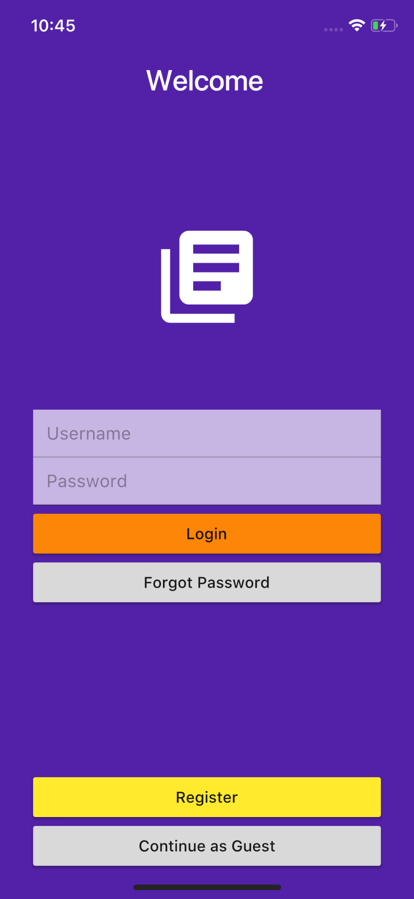
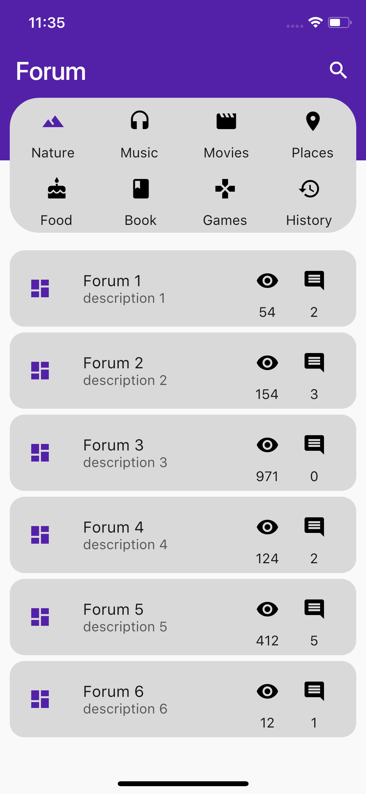

# Flutter Forum Application

Created using Flutter, I am learning about this amazing framework and creating UI for generic Forum application

# Login Screen

# Home Screen

# Forum Screen

## Getting Started

For help getting started with Flutter, view our online
[documentation](https://flutter.io/).
